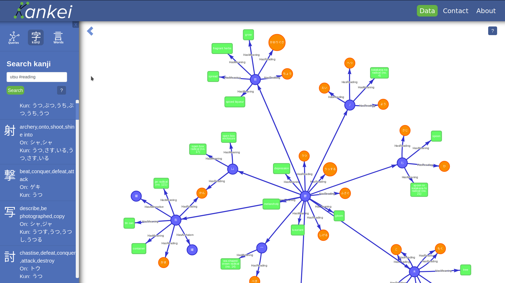
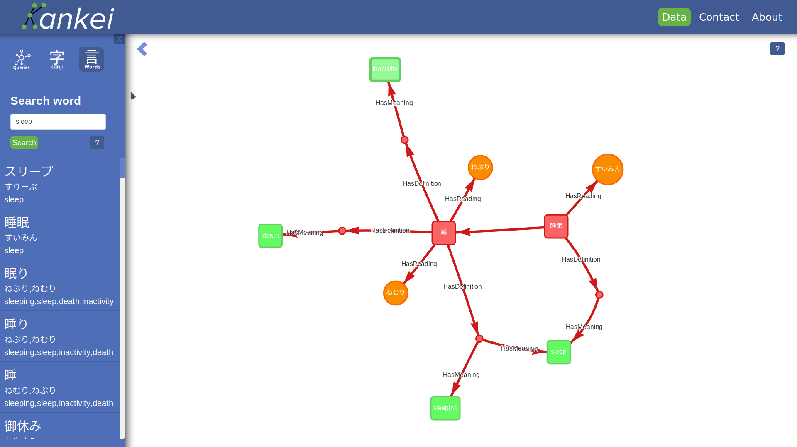
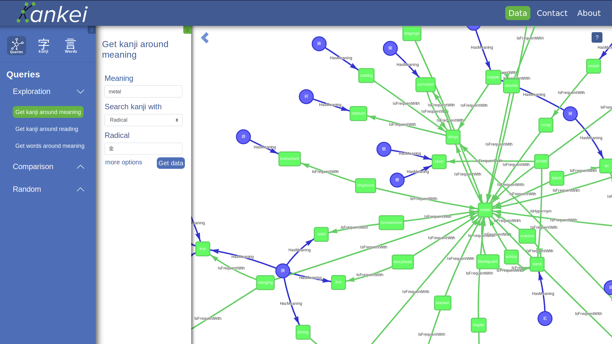
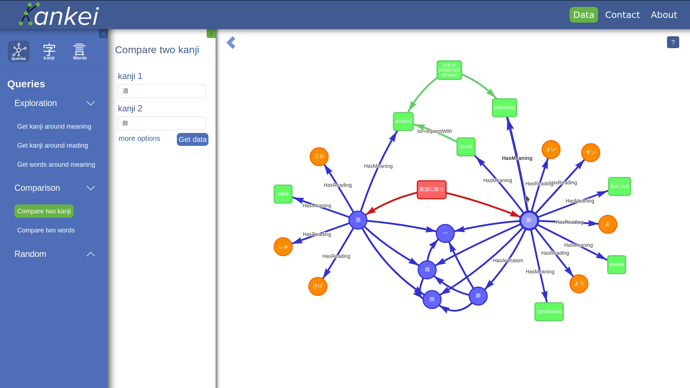
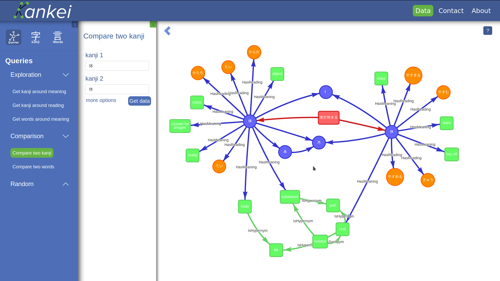

# kankei-frontend

Kankei is a university project focusing on creating a tool to help people learn about kanji. 
It currently contains about 200 000 japanese words and about 10 000 kanji

Kankei-Frontend is only a single part of the whole project. It contains a SPA application
created with Vue.js

## Example images


### Searching for elements

Search for kanji and word 





### Exploration

Get all the kanji that have the `metal` radical and also contains the meaning of metal



### Comparing kanji

Get the similarities between `alchohol` and `drunkness`




get the relations between `body` and `rest`




## Project setup
to setup npm packages
```
npm install
```
- to run the Application with the backend, please go the `Kankei-Backend` repository
  for more information about the setup

- to run also the Database, please contact me directly. The data are not openly shared to everyone
  since they come from personal data wrangling processes

### Compiles and hot-reloads for development
```
npm run dev
```

### Compiles and minifies for production
```
npm run build
```

## Authors

- Jérémie Bigras-Dunberry - Initial work
